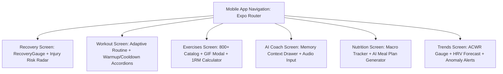
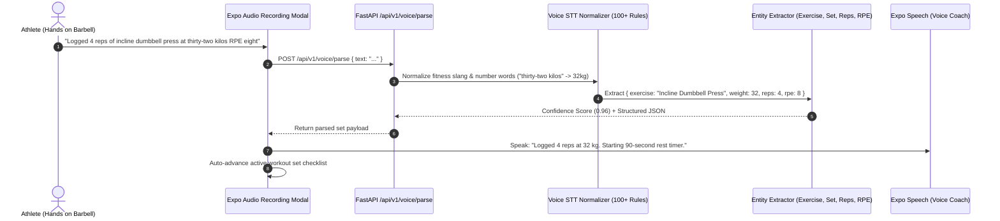
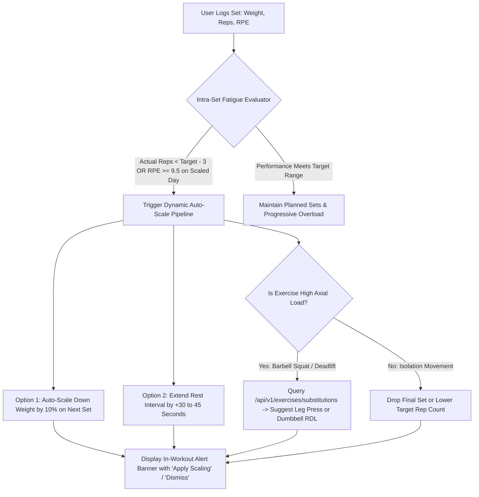
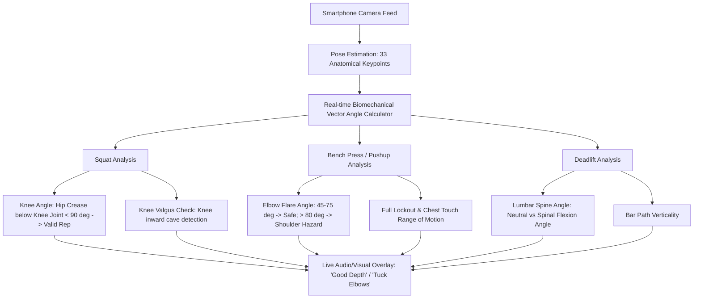
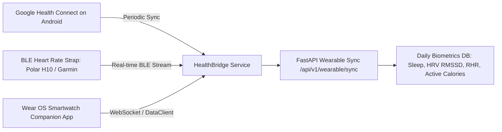
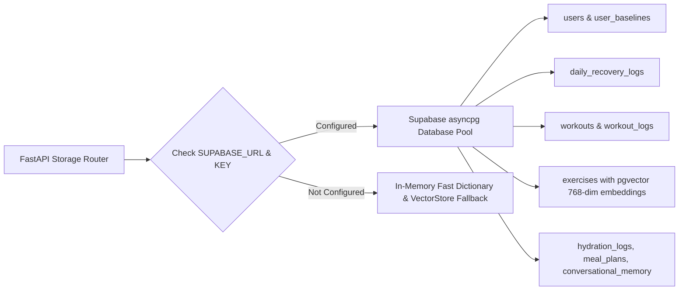
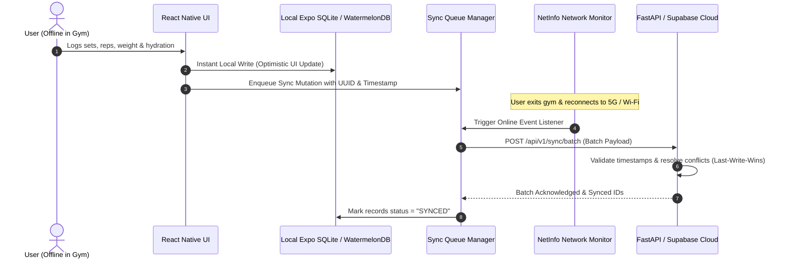
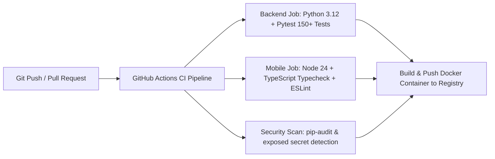

# ADAPFIT — Actionable Master TO-DO & Engineering Plan
**Personalized Fitness & Recovery Engine (Android / React Native Expo + FastAPI)**  
*Problem Statement PS 07: Personalized Fitness Plan Using Activity and Recovery Data (007-Synapse)*

---

## 1. Executive Master TO-DO Roadmap

```
 ┌─────────────────────────────────────────────────────────────────────────────────┐
 │                               MASTER TO-DO TRACKS                               │
 ├─────────────────────────────────────────────────────────────────────────────────┤
 │ [ ] TRACK 1: Mobile UI/UX & Interactive Feature Wire-Up (React Native Expo)    │
 │ [ ] TRACK 2: Hands-Free Voice Workout Logging & Interactive Audio Coach         │
 │ [ ] TRACK 3: In-Workout Dynamic Fatigue Scaling & Real-Time Substitutions       │
 │ [ ] TRACK 4: Computer Vision & On-Device Pose Estimation (Form Checker)         │
 │ [ ] TRACK 5: Wearable Ingestion, Wear OS Companion & BLE Sensor Bridge          │
 │ [ ] TRACK 6: Agentic AI, Multi-Agent Supervisor & WebSocket Streaming           │
 │ [ ] TRACK 7: Supabase PostgreSQL Cloud Persistence & RLS Migration Engine      │
 │ [ ] TRACK 8: Offline-First SQLite Engine & Background Sync Daemon               │
 │ [ ] TRACK 9: Comprehensive Test Automation (150+ Tests), CI/CD & Benchmarks     │
 └─────────────────────────────────────────────────────────────────────────────────┘
```

---

## TRACK 1: Mobile UI/UX & Interactive Feature Wire-Up

### Architectural Goal:
Complete all user journeys across the 11 mobile tab screens, connecting backend domain engines to interactive, animated React Native Expo components.



### Actionable TO-DO Tasks:
- [ ] **1.1 Warmup & Cooldown Interactive Accordion (`mobile/app/(tabs)/workout.tsx`)**:
  - Connect `api.getWarmupRoutine` and `api.getCooldownRoutine` based on prescribed workout muscle targets.
  - Render expandable accordion cards with step-by-step stretch instructions, countdown timers, and target muscle tags.
- [ ] **1.2 Exercise Detail & 1RM Calculator Modal (`mobile/app/(tabs)/exercises.tsx`)**:
  - Add full-screen interactive modal displaying HD GIF demonstration from `free-exercise-db`.
  - Add embedded 1RM calculator (Epley & Brzycki formulas) calculating user 1RM, 3RM, 5RM, 8RM, 10RM loads on the fly.
  - Add "Substitute Exercise" button querying `/api/v1/exercises/substitutions`.
- [ ] **1.3 Periodization & Training Calendar Interactive Grid (`mobile/app/(tabs)/periodization.tsx`)**:
  - Fetch user mesocycle / microcycle from `GET /api/v1/periodization/current`.
  - Display 7-day schedule with drag-and-drop or tap-to-reschedule rest and workout days.
  - Highlight deload weeks automatically when ACWR exceeds 1.5.
- [ ] **1.4 Community Feed & Fitness Challenges Screen (`mobile/app/(tabs)/social.tsx`)**:
  - Connect `GET /api/v1/challenges/list` and `GET /api/v1/community/feed`.
  - Implement "Join Challenge" button with live leaderboard progress bars.
  - Implement "Share Workout" card with volume PR badges and recovery score stickers.
- [ ] **1.5 UI Design Token Unification & Micro-Animations (`mobile/src/components/`)**:
  - Unify slate/indigo color tokens across all screens using NativeWind.
  - Add React Native Reanimated spring animations for gauge charts, rest timers, and streak badges.

---

## TRACK 2: Hands-Free Voice Workout Logging & Audio Coach

### Architectural Goal:
Enable gym athletes to log sets hands-free using on-device microphone transcription routed to the backend Voice STT Normalizer and receiving instant text-to-speech coaching cues.



### Actionable TO-DO Tasks:
- [ ] **2.1 Build Voice Logger BottomSheet Component (`mobile/src/components/VoiceLoggerModal.tsx`)**:
  - Audio recording state with pulsing animated soundwave visualizer.
  - Real-time Speech-to-Text streaming with fallback to on-device recording upload.
  - Action buttons: "Confirm Set", "Re-record", and "Edit Manually".
- [ ] **2.2 Connect Active Workout Screen to Voice Parser (`mobile/app/workout-active.tsx`)**:
  - Add floating microphone button in the set tracking header.
  - On voice capture, send transcription to `api.parseVoiceWorkout(text)`.
  - Automatically populate weight, reps, and RPE into the active set row and trigger rest timer.
- [ ] **2.3 Audio Coaching & Rest Timer Interval Chimes (`mobile/src/services/tts.ts`)**:
  - Integrate `expo-speech` and `expo-av` for audio rest timer milestones:
    - 30 seconds remaining chime.
    - "Rest finished. Next exercise: Barbell Bench Press, 3 sets of 8 reps."
    - Form reminders based on RAG coaching notes (e.g. "Retract scapula and keep feet planted").

---

## TRACK 3: In-Workout Dynamic Fatigue Scaling & Real-Time Substitutions

### Architectural Goal:
Detect acute performance drop-offs or excessive set fatigue in real-time during a workout and dynamically recalibrate remaining volume, intensity, and exercises.



### Actionable TO-DO Tasks:
- [ ] **3.1 Build Intra-Workout Auto-Scaling Engine (`mobile/src/services/autoScaler.ts`)**:
  - Track moving average RPE across completed sets in active session.
  - Trigger auto-scale rules when set RPE exceeds target RPE by $\ge 2.0$ points or reps fall $\ge 3$ reps below prescription.
- [ ] **3.2 Exercise Substitution Drawer in Active Workout (`mobile/app/workout-active.tsx`)**:
  - Add "Swap Exercise" action sheet displaying 3 alternative movements matching the same primary muscle group and equipment with lower axial load ratings.
  - Automatically update the session payload without resetting completed workout history.
- [ ] **3.3 Set Fatigue Feedback Storage (`backend/app/api/v1/endpoints/workouts.py`)**:
  - Ingest `set_adjustments` in `POST /api/v1/workouts/complete` to feed back into the Continuous Learning Loop (`learning_loop.py`).

---

## TRACK 4: Computer Vision & On-Device Pose Estimation (Form Checker)

### Architectural Goal:
Build an on-device camera form checker that computes real-time joint angles, validates exercise biomechanics, and counts reps with live feedback.



### Actionable TO-DO Tasks:
- [ ] **4.1 Create Form Checker Screen (`mobile/app/form-checker.tsx`)**:
  - Fullscreen camera preview with wireframe joint landmark overlay.
  - Floating rep counter and target exercise selector (Squat, Pushup, Bench Press, Bicep Curl).
- [ ] **4.2 Joint Angle Calculation Library (`mobile/src/utils/poseGeometry.ts`)**:
  - Implement 3-point planar angle calculation:
    $$\theta = \arccos\left(\frac{\vec{BA} \cdot \vec{BC}}{\|\vec{BA}\| \|\vec{BC}\|}\right)$$
  - Formulate threshold boundaries for Squats ($\theta_{\text{knee}} \le 90^\circ$ for depth), Pushups ($\theta_{\text{elbow}} \le 90^\circ$), and Deadlifts (lumbar spine delta $\le 15^\circ$).
- [ ] **4.3 Rep Counter State Machine (`mobile/src/utils/repCounter.ts`)**:
  - 3-state rep counter (`START` $\to$ `INFLECTION_PEAK` $\to$ `COMPLETION`) with hysteresis filtering to eliminate false double-counts.

---

## TRACK 5: Wearable Ingestion, Wear OS Companion & BLE Sensor Bridge

### Architectural Goal:
Directly ingest biometrics from Android Health Connect in the background, connect BLE heart rate chest straps, and provide a standalone Wear OS watch companion.



### Actionable TO-DO Tasks:
- [ ] **5.1 Background Android Health Connect Sync Daemon (`mobile/src/services/healthBridge.ts`)**:
  - Configure `expo-task-manager` and `expo-background-fetch` to query Android Health Connect every 4 hours.
  - Automatically sync overnight sleep sessions, morning resting heart rate, and 24h step counts without requiring user app launch.
- [ ] **5.2 Bluetooth Low Energy (BLE) Heart Rate Strap Client (`mobile/src/services/bleHeartRate.ts`)**:
  - Use `react-native-ble-plx` to scan for standard BLE Heart Rate Service (`0x180D`).
  - Stream live heart rate (BPM) into `workout-active.tsx` and compute real-time TRIMP cardiac workload.
- [ ] **5.3 Wear OS Companion Layout & Telemetry Sync (`backend/app/api/v1/endpoints/wearos.py`)**:
  - Create standalone watch screen layout displaying: Active Exercise Name, Current Set #, Target Reps/Weight, and Rest Timer Countdown with haptic buzz.

---

## TRACK 6: Agentic AI, Multi-Agent Supervisor & WebSocket Streaming

### Architectural Goal:
Upgrade the AI Coach from request-response REST into an autonomous multi-agent reasoning supervisor with real-time token streaming via WebSockets.

```mermaid
flowchart TD
    A[Athlete Message / Voice Query] --> B[Supervisor Agent Orchestrator]
    
    B --> C{Intent Classification & Domain Routing}
    C -->|Biometrics / Recovery| D1[Recovery Agent: Evaluates HRV, Sleep, ACWR]
    C -->|Workout Prescription| D2[Workout Generation Agent: Catalogs, Muscles, RPE]
    C -->|Nutrition / Macros| D3[Dietitian Agent: BMR, Meal Plans, Hydration]
    C -->|Pain / Injury Risk| D4[Safety & Prevention Agent: Muscle Vuln, Deloads]
    
    D1 & D2 & D3 & D4 --> E[Conversational Memory & RAG Knowledge Synthesis]
    E --> F[WebSocket Stream /ws/{user_id}]
    F --> G[Athlete Mobile App: Instant Real-time Typing Stream]
```

### Actionable TO-DO Tasks:
- [ ] **6.1 WebSocket Streaming Endpoint for AI Coach (`backend/app/api/v1/endpoints/chat.py`)**:
  - Implement `WebSocket /api/v1/chat/ws/{user_id}`.
  - Stream tokens generated by Gemini 2.0 Flash / Groq in real-time chunk-by-chunk to eliminate user latency.
- [ ] **6.2 Multi-Agent Supervisor Orchestrator (`backend/app/services/agent/supervisor.py`)**:
  - Wire specialized subagents (`RecoveryAgent`, `WorkoutAgent`, `NutritionAgent`, `SafetyAgent`) into a LangGraph / stateful supervisor pipeline.
  - Inject recent user preferences, workout logs, and pain flags from `conversational_memory.py`.
- [ ] **6.3 Autonomous Check-in Agent Notification Generator (`backend/app/services/notification_scheduler.py`)**:
  - Proactively trigger personalized morning notifications:
    - *"Good morning! Your HRV is 12% above baseline (+0.8z). Prime day for heavy deadlifts!"*
    - *"High acute workload detected (ACWR 1.52). Let's do active mobility today."*

---

## TRACK 7: Supabase PostgreSQL Cloud Persistence & RLS Migration Engine

### Architectural Goal:
Provide complete enterprise-grade cloud database persistence with Supabase PostgreSQL and `pgvector` alongside the zero-cost in-memory fallback.



### Actionable TO-DO Tasks:
- [ ] **7.1 Create SQL Migration DDL Scripts (`backend/supabase/migrations/001_initial_schema.sql`)**:
  - Write complete DDL with UUID primary keys, foreign keys, cascade deletes, and check constraints for all 36 domain modules.
  - Enable `pgvector` extension and define cosine distance indexes (`ivfflat` / `hnsw`) on `exercises.embedding`.
- [ ] **7.2 Row-Level Security (RLS) Policies (`backend/supabase/migrations/002_rls_policies.sql`)**:
  - Implement multi-tenant RLS policies ensuring users can only read/write their own biometrics, workouts, and chat history.
- [ ] **7.3 Implement Async Database Repository Pattern (`backend/app/db/repositories/`)**:
  - Create unified repository interfaces for `UserRepository`, `RecoveryRepository`, `WorkoutRepository`, `ExerciseRepository`, `MealPlanRepository`, and `MemoryRepository`.
  - Seamlessly route queries to Supabase when environment variables exist, falling back to in-memory dictionaries for zero-setup local dev.

---

## TRACK 8: Offline-First SQLite Engine & Background Sync Daemon

### Architectural Goal:
Guarantee seamless app functionality in subterranean gyms with zero internet connectivity via a local SQLite database that syncs conflict-free when reconnected.



### Actionable TO-DO Tasks:
- [ ] **8.1 Initialize Expo SQLite / WatermelonDB Schema (`mobile/src/db/`)**:
  - Define local tables for `workouts`, `workout_sets`, `recovery_logs`, `hydration_logs`, and `cached_exercises`.
  - Pre-populate exercise database locally during app installation for instant offline search.
- [ ] **8.2 Batch Synchronization API Endpoint (`backend/app/api/v1/endpoints/tasks.py`)**:
  - Create `POST /api/v1/sync/batch` accepting an array of timestamped mutations.
  - Implement idempotent upserts with conflict resolution based on `updated_at` timestamps.
- [ ] **8.3 Network Status Toast & Sync Status Indicator (`mobile/src/components/SyncStatusBadge.tsx`)**:
  - Show subtle indicator in header: 🟢 *Synced* / 🟡 *Syncing (3 items)* / ⚪ *Offline Mode (Saved locally)*.

---

## TRACK 9: Comprehensive Test Automation (150+ Tests), CI/CD & Benchmarks

### Architectural Goal:
Expand automated testing coverage from 102 tests to 150+ tests, set up GitHub Actions CI pipelines, and benchmark API throughput under high concurrency.



### Actionable TO-DO Tasks:
- [ ] **9.1 Expand Backend Pytest Suite to 150+ Tests (`backend/tests/`)**:
  - Add tests for new endpoints: Hydration daily goal streaks, Injury risk weekly slope trends, AI Meal planner food swap filters, Voice STT slang corrections, Conversational memory pain flags, and ACWR deload trigger edge cases.
- [ ] **9.2 Performance Benchmarking Script (`backend/scripts/benchmark.py`)**:
  - Measure response times for:
    - Recovery score calculation (< 5ms).
    - Exercise semantic vector search (< 15ms).
    - Intent classification & NL workout parsing (< 2ms).
- [ ] **9.3 GitHub Actions CI/CD Configuration (`.github/workflows/ci.yml`)**:
  - Automate test runs on every pull request.
  - Multi-stage Docker build validation and image vulnerability scan.

---

## 2. Priority Execution Checklist

```
  ┌─────────────────────────────────────────────────────────────────────────────────┐
  │                            IMMEDIATE ACTION CHECKLIST                           │
  ├─────────────────────────────────────────────────────────────────────────────────┤
  │ [ ] STEP 1: Implement Voice Logger BottomSheet in mobile/src/components/        │
  │ [ ] STEP 2: Connect Voice Logger mic button in mobile/app/workout-active.tsx    │
  │ [ ] STEP 3: Build Dynamic Warmup/Cooldown Accordions in workout.tsx             │
  │ [ ] STEP 4: Add Exercise 1RM Calculator & Video Modal in exercises.tsx          │
  │ [ ] STEP 5: Create Supabase PostgreSQL Initial Migration 001_initial_schema.sql │
  │ [ ] STEP 6: Write WebSocket Streaming Chat Endpoint in backend chat.py         │
  │ [ ] STEP 7: Expand Pytest Suite to 150+ Unit/Integration Tests                  │
  └─────────────────────────────────────────────────────────────────────────────────┘
```
